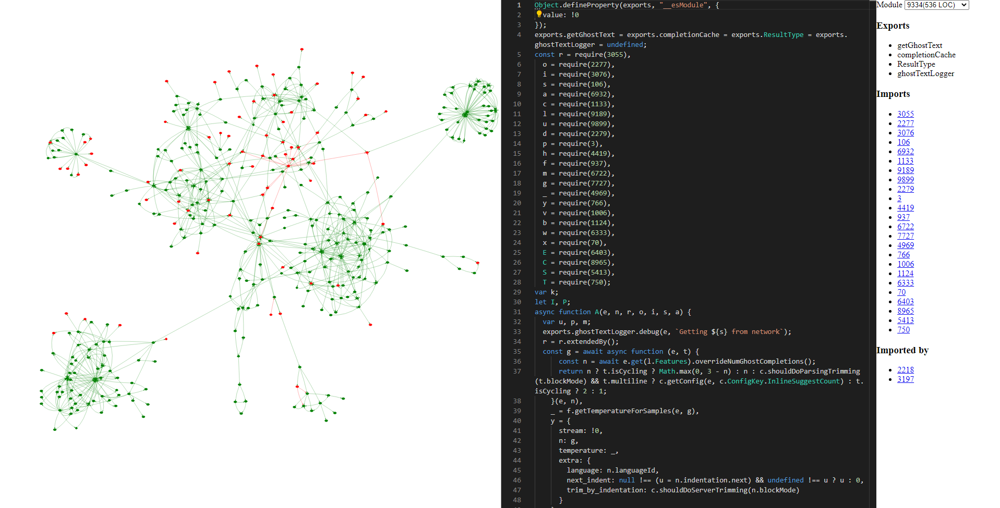

# Copilot-Explorer

This is a tool meant for exploring the codebase of Github Copilot (the client side, not the model itself).

It's work in progress. See the [Journal](./Journal.md) for details on what's been done so far and my observations.

## Screenshots

## Just show me the tool

You can access a version of the tool [here](codeviz/templates/code-viz.html).

This explores version 1.57.7193 of the VSCode extension of Copilot.

The webpage shows 3 panels:
- Left most shows the module-level callgraph of the extension. The dependencies are based on imports.
- Middle panel shows the prettified code of the selected module. By default the main module is selected.
- Right panel shows some information about the model (specifically, the module id, exports, imports and modules that import this module).

The modules don't have names because these have been extracted by a bit of deobfuscation, and the original obfuscated code didn't have names. I'm working on a way to provide reasonable names to the modules. Currently I have a hacky system that allows manual renaming of modules, but it's not synced. Your edits do stay on local storage though.

### Interesting modules

Some interesting modules I've found so far (most interesting at the **bottom**):
- **Prompting**:
  - [3055 (imported by 2533 and packs a ton of stuff)](codeviz/templates/code-viz.html#m3055)
    - 3055 was actually a jumbo module that had multiple nested modules in it. I extracted them as top level modules. Each of those modules begins with 3055\<something\>.
    - e.g., **the actual definition of `getPrompt` is in [3055312](codeviz/templates/code-viz.html#m3055312)**
  - [2388 seems to identify the repo to which the code belongs, and also suggests Copilot has different modes of completion: "OPEN_COPILOT", "TODO_QUICK_FIX", "UNKNOWN_FUNCTION_QUICK_FIX"](codeviz/templates/code-viz.html#m2388)
  - [9189 (does something with neighbouring tabs)](codeviz/templates/code-viz.html#m9189)  
  - [2533 (`parsesWithoutError`, `getPrompt`, `getNodeStart`, ... all useful stuff)](codeviz/templates/code-viz.html#m2533)

- **Completion**:
  There appear to be two main workflows for completion:
  - Inline-Completions (the stuff you most commonly use, where copilot autocompletes as you type).
    - [3197 appears to be the main module for this](codeviz/templates/code-viz.html#m3197). This is imported by the main module and it registers an inline-completion-provider. The `class v` there is actually the InlineCompletionItemProvider.
      - I've manually added some comments and renamed some variables to make it easier to understand. You can see the modified code [here](codeviz/data/manually_annotated_modules/3197.js).
    - [9334 appears to be the module that contains the core logic for inline completion. It defines `getGhostText`.](codeviz/templates/code-viz.html#m9334). Depends on lots of other copilot modules. Only two hops away from the main module. The core functionality appears to the following:
      - Use cached suggestions if available
      - If user is typing, provide suggestions that match the typed text
      - Make network call if necessary, while waiting for debouncing period to pass
      - Take care of cases where user is "cycling" through choices specially. Didn't pay much attention here.
      - A lot of recording of telemetry data
      - You can read my commented version of the code [here](codeviz/data/manually_annotated_modules/9334.js).
    - [2218 is a simple helper module that seems relevant too](codeviz/templates/code-viz.html#m2218)
  
  - Panel Completion (the stuff shown if you press ctrl+enter)
    - [2388 seems to contain the main logic for this](codeviz/templates/code-viz.html#m2388).
      - I've manually added some comments and renamed some variables to make it easier to understand. You can see the modified code [here](codeviz/data/manually_annotated_modules/2388.js).
    - [893 seems like a wrapper over 2388](codeviz/templates/code-viz.html#m893)
    - [2990 is the main copilot-panel module](codeviz/templates/code-viz.html#m2990). This is imported by the main module. You can see this contains the "Accept Solution" and "Replace code with this solution" buttons.

- **Telemetry**:
  - [7017 seems to track changes after accept/reject of suggestions](codeviz/templates/code-viz.html#m7017).
    - The most interesting thing to me here was that they measure the effectiveness of the insertion at 5 points -- 15s/30s/2min/5min/10min after the suggestion was accepted. For rejection, they only capture after 30s (other timestamps are ignored).
    - At these timestamps, they measure how much of the suggestion was still present in a window around the insertion point.
      - The above is quantified in terms of edit-distance (at character level and at token-level. A token is most likely just stuff separated by spaces or something like that. Details can be found in [5120](codeviz/templates/code-viz.html#m5120))
      - Haven't fully understood the details of the measurement. Will need to play around a bit more to understand this.
    - Also, at the 30s timestamp, the telemetry calls "captureCode" (regardless of whether the suggestion was accepted or rejected). Here they basically look at the insertion point, extract the prompt that'd be used to make a suggestion at this insertion point (idk why they re-extract instead of caching it), and also extract stuff after the insertion point till some length they compute. Haven't yet understood till where they look after the insertion point.
  - [6333 appears to be the main Telemetry code](codeviz/templates/code-viz.html#m6333)

- **Network**:
  - [4419 (OpenAIFetcher) - this seems to be where the network communication takes place](codeviz/templates/code-viz.html#m4419)
      - [2279 (HelixFetcher. Seems to be an important library component mostly relevant to network)](codeviz/templates/code-viz.html#m2279)
      - [5413 (seems to control debouncing)](codeviz/templates/code-viz.html#m5413)

- **Misc**:
  - [9496 (`vscode` - things that import it are likely important)](codeviz/templates/code-viz.html#m9496)
  - [1862 (VSCodeCopilotTokenManager! - auth stuff)](codeviz/templates/code-viz.html#m1862)

## How to run locally

If you want to play with the code (different transformations, different visualizations, etc.), you can run the tool locally and modify the code.

1. Clone the repo
2. Run `npm install`
3. Run `node index.js` -- this processes the copilot extension code and produces modules by doing some automatic reverse engineering.

Steps 2 and 3 are optional. They're only needed if you modify the extension code or the transformation code. The repo already contains the processed modules.

4. Run `python3 code-viz/app.py` to start the app.
5. Head to `localhost:5000` in your browser.

## Support and Warranty

lmao