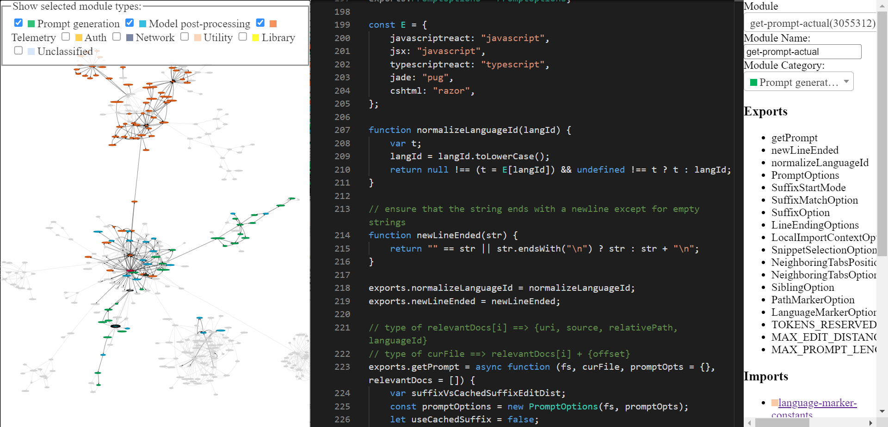

<!-- omit in toc -->
# Copilot Internals

Github Copilot has been incredibly useful to me. It can often magically read my mind and make useful suggestions. The thing that surprised me the most was its ability to correctly "guess" functions/variables from surrounding code -- including from other files. This can only happen, if the copilot extension sends valuable information from surrounding code to the Codex model. I was curious about how it worked, so I decided to take a look at the source code.

In this post, I try to answer specific questions about the internals of Copilot, while also describing some interesting observations I made while combing through the code. I try to provide pointers to the relevant code for almost everything I talk about, so that interested folks can take a look at the code themselves.

<!-- omit in toc -->
## Overview

This post is organized as follows:

- [Reverse Engineering preview](#reverse-engineering-preview)
- [Copilot: a 10,000 feet view](#copilot-a-10000-feet-view)
- [Secret Sauce 1 - Prompt engineering](#secret-sauce-1---prompt-engineering)
  - [What does a prompt look like?](#what-does-a-prompt-look-like)
  - [How is the prompt prepared? A code walkthrough.](#how-is-the-prompt-prepared-a-code-walkthrough)
    - [A close look at Snippet Extraction](#a-close-look-at-snippet-extraction)
- [Secret Sauce 2 - Model Invocation](#secret-sauce-2---model-invocation)
  - [Inline/GhostText](#inlineghosttext)
    - [Preventing poor requests via Contextual Filter](#preventing-poor-requests-via-contextual-filter)
  - [Copilot Panel](#copilot-panel)
- [Secret Sauce 3 - Telemetry](#secret-sauce-3---telemetry)
  - [Question 1: How is the 40% number measured?](#question-1-how-is-the-40-number-measured)
  - [Question 2: Does telemetry data include code snippets?](#question-2-does-telemetry-data-include-code-snippets)
- [Other random tidbits](#other-random-tidbits)
- [Onwards](#onwards)

## Reverse Engineering preview

I had performed a very shallow ["reverse engineering"](https://twitter.com/parth007_96/status/1546762772708413440) of the extension couple of months back, but I'd been wanting to do a deeper dive. Finally got around to doing that in the last few weeks. Very roughly, I took the [extension.js](../muse/github.copilot-1.57.7193/dist/extension.js) file included with Copilot, performed some minor [manual changes](../muse/github.copilot-1.57.7193/dist/extension_expanded_v2.js) to ease automatic extraction of modules, wrote a bunch of [AST transforms](../index.js) to "prettify" each module, [named and classified](../codeviz/predict_module_names_and_categories.py) the modules and manually annotated a handful of most interesting modules.

The reverse engineered copilot codebase can be explored via this tool I built ([home page](https://thakkarparth007.github.io/copilot-explorer/), [tool itself](https://thakkarparth007.github.io/copilot-explorer/codeviz/templates/code-viz.html)). It might have some rough edges, but you can use it to explore Copilot's code. The final tool looks like this. Do checkout the home page if you're confused about how to use it.



## Copilot: a 10,000 feet view

There are two main components of Github Copilot:

1. **Client**: The VSCode extension collects whatever you type (called `prompt`), and sends it to a [Codex](https://beta.openai.com/docs/guides/completion/introduction)-like model. Whatever the model returns, it then displays in your editor.

2. **Model**: The Codex-like model takes the prompt and returns suggestions that complete the prompt.

## Secret Sauce 1 - Prompt engineering

Now, Codex has been trained on a lot of public Github code, so it makes sense that it can make useful suggestions. But Codex can't possibly know what functions exist in your current project. Despite this, Copilot often produces suggestions involving functions from your project. How does it do that?

Let's answer that in two parts: first let's see a real prompt generated by copilot, and then we'll see how it's generated.

### What does a prompt look like?

That's because the extension encodes a bunch of information about your project in the prompt. Copilot has a rather sophisticated prompt engineering pipeline. Here's an example of the prompt:

```json
{
  "prefix": "# Path: codeviz\\app.py\n# Compare this snippet from codeviz\\predictions.py:\n# import json\n# import sys\n# import time\n# from manifest import Manifest\n# \n# sys.path.append(__file__ + \"/..\")\n# from common import module_codes, module_deps, module_categories, data_dir, cur_dir\n# \n# gold_annots = json.loads(open(data_dir / \"gold_annotations.js\").read().replace(\"let gold_annotations = \", \"\"))\n# \n# M = Manifest(\n#     client_name = \"openai\",\n#     client_connection = open(cur_dir / \".openai-api-key\").read().strip(),\n#     cache_name = \"sqlite\",\n#     cache_connection = \"codeviz_openai_cache.db\",\n#     engine = \"code-davinci-002\",\n# )\n# \n# def predict_with_retries(*args, **kwargs):\n#     for _ in range(5):\n#         try:\n#             return M.run(*args, **kwargs)\n#         except Exception as e:\n#             if \"too many requests\" in str(e).lower():\n#                 print(\"Too many requests, waiting 30 seconds...\")\n#                 time.sleep(30)\n#                 continue\n#             else:\n#                 raise e\n#     raise Exception(\"Too many retries\")\n# \n# def collect_module_prediction_context(module_id):\n#     module_exports = module_deps[module_id][\"exports\"]\n#     module_exports = [m for m in module_exports if m != \"default\" and \"complex-export\" not in m]\n#     if len(module_exports) == 0:\n#         module_exports = \"\"\n#     else:\n#         module_exports = \"It exports the following symbols: \" + \", \".join(module_exports)\n#     \n#     # get module snippet\n#     module_code_snippet = module_codes[module_id]\n#     # snip to first 50 lines:\n#     module_code_snippet = module_code_snippet.split(\"\\n\")\n#     if len(module_code_snippet) > 50:\n#         module_code_snippet = \"\\n\".join(module_code_snippet[:50]) + \"\\n...\"\n#     else:\n#         module_code_snippet = \"\\n\".join(module_code_snippet)\n#     \n#     return {\"exports\": module_exports, \"snippet\": module_code_snippet}\n# \n# #### Name prediction ####\n# \n# def _get_prompt_for_module_name_prediction(module_id):\n#     context = collect_module_prediction_context(module_id)\n#     module_exports = context[\"exports\"]\n#     module_code_snippet = context[\"snippet\"]\n# \n#     prompt = f\"\"\"\\\n# Consider the code snippet of an unmodule named.\n# \nimport json\nfrom flask import Flask, render_template, request, send_from_directory\nfrom common import *\nfrom predictions import predict_snippet_description, predict_module_name\n\napp = Flask(__name__)\n\n@app.route('/')\ndef home():\n    return render_template('code-viz.html')\n\n@app.route('/data/<path:filename>')\ndef get_data_files(filename):\n    return send_from_directory(data_dir, filename)\n\n@app.route('/api/describe_snippet', methods=['POST'])\ndef describe_snippet():\n    module_id = request.json['module_id']\n    module_name = request.json['module_name']\n    snippet = request.json['snippet']\n    description = predict_snippet_description(\n        module_id,\n        module_name,\n        snippet,\n    )\n    return json.dumps({'description': description})\n\n# predict name of a module given its id\n@app.route('/api/predict_module_name', methods=['POST'])\ndef suggest_module_name():\n    module_id = request.json['module_id']\n    module_name = predict_module_name(module_id)\n",
  "suffix": "if __name__ == '__main__':\r\n    app.run(debug=True)",
  "isFimEnabled": true,
  "promptElementRanges": [
    { "kind": "PathMarker", "start": 0, "end": 23 },
    { "kind": "SimilarFile", "start": 23, "end": 2219 },
    { "kind": "BeforeCursor", "start": 2219, "end": 3142 }
  ]
}
```

As you can see, this prompt includes both a prefix and a suffix. Copilot will then send this prompt (after some formatting) to the model. In this case, Copilot is invoking Codex in ["insert mode"](https://beta.openai.com/docs/guides/code/inserting-code) aka fill-in-middle (FIM) mode, because suffix is non-empty.

If you inspect the prefix (see [here for easy viewing](./prompt-full)), you'll see that it includes some code from another file in the project. Look at the `# Compare this snippet from codeviz\\predictions.py:` line and its following lines.

### How is the prompt prepared? A code walkthrough.

Roughly, the following sequence of steps are executed to generate the prompt:

1. **Entry point**: Prompt extraction happens for a given document and cursor position. The main entry-point of prompt generation is [`extractPrompt(ctx, doc, insertPos)`](../codeviz/templates/code-viz.html#m4969&pos=172:6)
2. The document's relative path and language ID are queried from VSCode. See [`getPromptForRegularDoc(ctx, doc, insertPos)`](../codeviz/templates/code-viz.html#m4969&pos=158:1).
3. **Relevant Docs**: Then, most recently accessed 20 files of the same language are queried from VSCode. See [`getPromptHelper(ctx, docText, insertOffset, docRelPath, docUri, docLangId)`](../codeviz/templates/code-viz.html#m4969&pos=29:1). These files later get used for extracting similar snippets to be included in the prompt. I personally find it strange that the same language is used as a filter, because multi-language developments are quite common. But I guess this still covers most cases.
4. **Configuration**: Next, some options are set. Specifically:
   1. `suffixPercent` (how much of the prompt tokens should be dedicated to suffix? Default seems to be 15%)
   2. `fimSuffixLengthThreshold` (minimum length of suffix to enable Fill-in-middle? Defaults to -1, so FIM is always enabled as long as suffix is non-empty but this is controlled by AB Experimentation framework)
   3. `includeSiblingFunctions` appears to have been hardcoded to be false, as long as `suffixPercent` is above 0 (which is true by default).

5. **Prefix computation**: Now, a "Prompt Wishlist" is created for computing the prefix part of the prompt. Here, different "elements" along with their priorities are added. E.g., an element can be something like the "Compare this snippet from \<path\>", or local import context, or the language ID and/or path of each file. This happens in [`getPrompt(fs, curFile, promptOpts = {}, relevantDocs = [])`](../codeviz/templates/code-viz.html#m3055312&pos=223:1).
   1. There are [6 different types of "elements"](../codeviz/templates/code-viz.html#m3055456&pos=16:3) -- `BeforeCursor`, `AfterCursor`, `SimilarFile`, `ImportedFile`, `LanguageMarker`, `PathMarker`.
   2. Since the prompt size is limited, the wishlist is sorted by priority and insertion order, followed by adding the elements to the prompt until the size limit is reached. This "fulfillment" logic is implemented in [`PromptWishlist.fulfill(tokenBudget)`](../codeviz/templates/code-viz.html#m3055456&pos=176:3).
   3. Some options such as `LanguageMarkerOption`, `NeighboringTabsPositionOption`, `SuffixStartMode` etc. control the insertion order and priorities of these elements. Some control how certain information is extracted, e.g., `NeighboringTabsOption` controls how aggressively snippets from other files are extracted. Some options are only defined for certain languages, e.g., `LocalImportContextOption` is only defined for Typescript.
   4. Interestingly, there's quite a lot of code dealing with ordering of these elements. Not sure if all of that code is used, some things look like dead code to me. e.g., `neighboringTabsPosition` never seems to be set to `DirectlyAboveCursor`...but I could be wrong. Similarly, the [`SiblingOption` seems to be hardcoded to `NoSiblings`](../codeviz/templates/code-viz.html#m4969&pos=128:1), which means there's no _actual_ sibling function extraction happening. Again, maybe it's planned for future, or maybe it's just dead code.
6. **Suffix computation**: The previous step was for prefix, but the [logic for suffix](../codeviz/templates/code-viz.html#m3055312&pos=452:9) is relatively simple -- just fill the available token budget with whatever suffix is available from the cursor. That's the default, but the starting position of the suffix varies slightly depending on the `SuffixStartMode` option. This is controlled by [AB Experimentation](../codeviz/templates/code-viz.html#m9189&pos=343:3) [framework](../codeviz/templates/code-viz.html#m219&pos=25:1). E.g., if `SuffixStartMode` is `SiblingBlock`, then Copilot will first find the nearest function that's a sibling to the function being edited, and start the suffix from there.
   - **Suffix Caching**: One weird thing Copilot does is it [caches the suffix across calls](../codeviz/templates/code-viz.html#m3055312&pos=40:1), as long as the new suffix isn't "too far" from the cached suffix. No clue why that's being done. Or maybe I misunderstood the obfuscated code (although I can't find an alternative explanation for the code).


#### A close look at Snippet Extraction

The most complete part of prompt generation, to me, appears to be snippet extraction from other files. This gets invoked [here](../codeviz/templates/code-viz.html#m3055312&pos=303:29) and is defined in [neighbor-snippet-selector.getNeighbourSnippets](../codeviz/templates/code-viz.html#m3055125&pos=46:1). Depending upon the options, this either uses a ["Fixed window Jaccard matcher"](../codeviz/templates/code-viz.html#m3055404&pos=10:1) or an ["Indentation based Jaccard Matcher"](../codeviz/templates/code-viz.html#m3055404&pos=42:1). I'm not 100% sure, but looks like the Indentation based Jaccard Matcher isn't _actually_ used.

By [default](../codeviz/templates/code-viz.html#m3055312&pos=148:1), the fixed window Jaccard Matcher is used. This class slices up a given file (from which snippets are to be extracted) into [sliding windows of a fixed size](../codeviz/templates/code-viz.html#m3055404&pos=18:3). It then [computes Jaccard similarity](../codeviz/templates/code-viz.html#m3055467&pos=61:3) between each window and the reference file (the file you're typing in). Only the best window is returned from each "relevant file" (although provision to return top K snippets exists, it's never used). By default, the FixedWindowJaccardMatcher is used in ["Eager mode"](../codeviz/templates/code-viz.html#m3055125&pos=34:3) (i.e., window size of 60 lines). However, the mode is [controlled](../codeviz/templates/code-viz.html#m4969&pos=111:1) by [AB Experimentation framework](../codeviz/templates/code-viz.html#m9189&pos=364:1), so other modes might be used.

## Secret Sauce 2 - Model Invocation

There are two UIs through which Copilot provides completions: (a) Inline/GhostText and (b) Copilot Panel. There are some differences in how the model is invoked in these two cases.

### Inline/GhostText

[Main module](../codeviz/templates/code-viz.html#m9334&pos=301:14)

Here, the extension asks for very few suggestions (1-3) from the model in order to be fast. It also aggressively caches results from the model. Furthermore, it takes care of adapting the suggestions if the user continues typing. It also takes care of debouncing the model requests if the user is typing fast.

This UI also has some logic to prevent sending requests in some cases. For example, if the user is in the [middle of a line](../codeviz/templates/code-viz.html#m9334&pos=327:5), then the request is only sent if the characters to the right of the cursor are whitespace, closing braces etc.

#### Preventing poor requests via Contextual Filter

More interestingly, after generating the prompt, this module checks if the prompt is ["good enough"](../codeviz/templates/code-viz.html#m9334&pos=733:1) to bother with invoking the model. It does this by computing what is called ["contextual filter score"](../codeviz/templates/code-viz.html#m8965&pos=22:1). This score seems to be based on a simple logistic regression model over 11 features such as the language, whether previous suggestion was accepted/rejected, duration between previous accept/reject, length of last line in the prompt, last character before cursor, etc. The model weights are [included in the extension code itself](../codeviz/templates/code-viz.html#m7744&pos=1:1).

If the score is below a threshold (default [15%](../codeviz/templates/code-viz.html#m7744&pos=10:1)), then the request isn't made. It'd be interesting to poke around this model. A few observations I made were that some languages had higher weight than others (e.g. `php > js > python > rust > dart`...`php`, really?). Another, intuitive observation was that if the prompt ended with `)` or `]`, then the score was lower (`-0.999`, `-0.970`) than if it ended with `(` or `[` (`0.932`, `0.049`). That makes sense, because the former is more likely to be already "completed", whereas the latter clearly indicates that the user would benefit from auto-completion.

### Copilot Panel

[Main module](../codeviz/templates/code-viz.html#m2990&pos=12:1), [Core logic 1](../codeviz/templates/code-viz.html#m893&pos=9:1), [Core logic 2](../codeviz/templates/code-viz.html#m2388&pos=67:1).

This UI requests more samples (10 by default) from the model than the inline UI. This UI doesn't appear to have contextual filter logic (makes sense, if the user explicitly invoked this, you don't want to not prompt the model).

There are two main interesting things here:
1. Depending upon the mode in which this is invoked (`OPEN_COPILOT`/`TODO_QUICK_FIX`/`UNKNOWN_FUNCTION_QUICK_FIX`), it [modifies the prompt slightly](../codeviz/templates/code-viz.html#m2388&pos=113:1). Don't ask me how these modes are activated.
2. It requests for logprobs from the model, and the list of solutions are [sorted by the mean logprobs](../codeviz/templates/code-viz.html#m893&pos=105:5).

## Secret Sauce 3 - Telemetry

Github [claims](https://github.blog/2022-06-21-github-copilot-is-generally-available-to-all-developers/) that 40% of the code programmers write is written by Copilot (for popular languages like Python). I was curious how they measured this number, and so wanted to poke a bit into the telemetry code.

I also wanted to know what telemetry data is being collected, especially whether code snippets are being collected. I wanted to know this, because while we can easily point Copilot extension to the open-source [FauxPilot](https://github.com/moyix/fauxpilot) backend instead of Github's backend, the extension might still end up sending code snippets via telemetry to Github, preventing anyone paranoid about their code's privacy from using Copilot. I wanted to know if this was the case.

### Question 1: How is the 40% number measured?

Measuring Copilot's success rate isn't just a matter of trivially computing the number of accepts/number of rejects. That's because people typically accept and then make some modifications. As a result, Github folks check if the suggestion that was accepted is still present in the code. This gets done at different time lengths after the insertion. Specifically, after [15s, 30s, 2min, 5min and 10min timeouts](../codeviz/templates/code-viz.html#m7017&pos=21:3), the extension measures if the accepted suggestion is "still in code".

Now, doing an exact search for the presence of the accepted suggestion is too stringent, so instead they measure [edit distance](../codeviz/templates/code-viz.html#m7017&pos=125:3) (at character level and word level) between the suggested text, and a window around the insertion point. Then, if the 'word' level edit distance between inserted and the window is less than 50% (normalized to suggestion size), then the suggestion is considered ["still in code"](../codeviz/templates/code-viz.html#m7017&pos=142:7).

Of course, this only happens for accepted code.

### Question 2: Does telemetry data include code snippets?

Yes.

[After 30s](../codeviz/templates/code-viz.html#m7017&pos=29:7) of either acceptance/rejection of a suggestion, copilot ["captures" a snapshot](../codeviz/templates/code-viz.html#m7017&pos=49:3) around the insertion point. In particular, the extension [invokes the prompt extraction](../codeviz/templates/code-viz.html#m7017&pos=84:5) mechanism to collect a "hypothetical prompt" that could've been used to make a suggestion at that point. It also captures a "hypothetical completion" by [capturing the code between insertion point and a "guessed" endpoint](../codeviz/templates/code-viz.html#m7017&pos=114:7), i.e., the point after which code irrelevant to the completion starts. I haven't really understood how it guesses this endpoint. As stated before, this happens both after [acceptance](../codeviz/templates/code-viz.html#m7017&pos=239:17) or [rejection](../codeviz/templates/code-viz.html#m7017&pos=156:9).

I suspect that these snapshots basically function as training data for further improving the model. However, 30 seconds seems like a very short time for assuming that the code has "stabilized". But, I guess that even if the 30 second timeout produces noisy data points, given that the telemetry includes the github repo corresponding to the user's project, Copilot folks can perhaps clean this relatively noisy data offline. All of this is just my speculation.

<!-- Interestingly, the rejection telemetry collection isn't invoked from the Copilot Panel UI, [only the acceptance telemetry](../codeviz/templates/code-viz.html#m2990&pos=97:13) collection is. I think this is sensible. For inline completion UI, both acceptance and rejection telemetry is collected. -->

## Other random tidbits

I modified the extension code slightly to enable verbose logging (couldn't find a configurable parameter for this). I found out that the model is called "**cushman-ml**", which strongly suggests that Copilot is using a **12B parameter model instead of a 175B parameter model**. That's super encouraging for open-source efforts, implying that a medium sized model can provide good suggestions like this. Of course, they'd still not have the data flywheel that Github has.

One thing I've not covered in this exploration is the [worker.js](../muse/github.copilot-1.57.7193/dist/worker_expanded.js) file that ships with the extension. At a cursory glance, it seems to basically just provide parallelized version of the prompt-extraction logic, but there could be more to it.

## Onwards

This was a fun little project, but it required some manual annotation/reverse engineering. I'd like to automate a good amount of this so I can also explore different versions of Copilot, or explore Copilot labs...or in general just perform automatic decompilation of obfuscated JS code. My initial experiments with using ChatGPT/Codex were encouraging, but the issue is they're not reliable. I have an idea in mind to automatically check if the decompilation is correct, by basically doing a form of abstract interpretation. But that's for another day.

The code for this project is available [here](https://github.com/thakkarparth007/copilot-explorer). Feel free to poke around, file issues and send PRs in case you have any suggestions or improvements (e.g., you could annotate some more interesting modules, or post your own findings there).